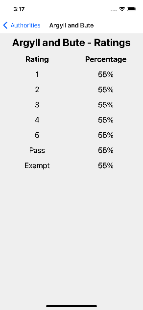

# Infinity Works - React Native Tech Test

## Getting started

### Clone this repo

```
$ git clone https://github.com/infinityworks/iw-tech-test-react-native.git
$ cd /path/to/iw-tech-test-react-native # instructions assume you are in this folder
```

### Set up your development environment
Follow the instructions [here](https://reactnative.dev/docs/environment-setup) to set up your development environment for either iOS or Android.


### Visual Studio Code

We recommend [Visual Studio Code](https://code.visualstudio.com/). There are workspace settings in [`.vscode/settings.json`](.vscode/settings.json) that will automatically format the code and fix any linting issues on save.

For this to work, you must also install the [Microsoft ESLint extension](https://marketplace.visualstudio.com/items?itemName=dbaeumer.vscode-eslint).

### Install packages

```
$ npm install
```

### iOS only: Install CocoaPods

```
$ npx pod-install ios # this may take a while
```

### Run Metro

```
$ npx react-native start
```

### Run the app on an Android Emulator

```
$ npx react-native run-android
```

### Run the app on an iOS Simulator

```
$ npx react-native run-ios
```

## Submission

* Do __NOT__ fork this repository
* Do __NOT__ commit your code to a public GitHub repo

## Screenshots



